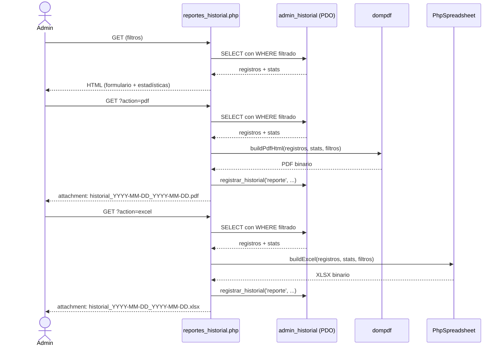

# Documento de Diseño: admin-historial-reportes

## Visión General

Este módulo agrega generación y descarga de reportes en PDF y Excel del historial de actividad del panel de administración del CMS DIF San Mateo Atenco. Se implementa como un único archivo nuevo (`admin/reportes_historial.php`) que reutiliza la infraestructura existente: conexión PDO de `includes/db.php`, funciones de `admin/historial_helper.php`, y la estructura visual del panel (sidebar, navbar, estilos).

Las librerías de generación se instalan vía Composer:
- **dompdf/dompdf** — renderiza HTML+CSS a PDF (permite gráficas CSS sin dependencias de imagen)
- **phpoffice/phpspreadsheet** — genera archivos `.xlsx` con formato, hojas múltiples y AutoFilter

El flujo es: el administrador aplica filtros en la página → previsualiza estadísticas → descarga PDF o Excel. Cada descarga queda registrada en `admin_historial` con `accion = 'reporte'`.

---

## Arquitectura

```
admin/reportes_historial.php
  ├── require auth_guard.php          (sesión + rol)
  ├── require csrf.php                (token para formulario)
  ├── require includes/db.php         (PDO singleton)
  ├── require historial_helper.php    (registrar_historial, historial_badge)
  ├── require sidebar_sections.php    (render_admin_sidebar)
  └── require vendor/autoload.php     (dompdf + phpspreadsheet)

Flujo de petición:
  GET  ?action=pdf   → genera PDF  → Content-Disposition: attachment
  GET  ?action=excel → genera XLSX → Content-Disposition: attachment
  GET  (sin action)  → muestra formulario + estadísticas (HTML)
```



---

## Componentes e Interfaces

### `admin/reportes_historial.php`

Archivo principal. Maneja tres modos según `$_GET['action']`:

| Modo | Condición | Salida |
|------|-----------|--------|
| Vista HTML | `action` ausente o inválido | Página con formulario + estadísticas |
| Descarga PDF | `action === 'pdf'` | Binario PDF con headers de descarga |
| Descarga Excel | `action === 'excel'` | Binario XLSX con headers de descarga |

**Funciones internas:**

```php
// Construye WHERE clause y params array a partir de los filtros GET
function build_filter_query(array $get): array
// Retorna ['where' => string, 'params' => array]

// Genera el HTML que dompdf renderizará como PDF
function build_pdf_html(array $registros, array $stats, array $stats_dia, array $filtros): string

// Genera el objeto Spreadsheet con hojas Historial + Estadísticas
function build_excel(array $registros, array $stats, array $stats_seccion, array $filtros): \PhpOffice\PhpSpreadsheet\Spreadsheet

// Genera el nombre de archivo con el patrón requerido
function report_filename(string $fecha_ini, string $fecha_fin, string $ext): string
// Retorna: "historial_{fecha_ini}_{fecha_fin}.{ext}"
```

### Modificación a `admin/sidebar_sections.php`

Se agrega un ítem al grupo `'Sistema'`:

```php
['title' => 'Reportes', 'file' => 'reportes_historial.php', 'icon' => 'bi-file-earmark-bar-graph'],
```

### `composer.json` (actualización)

```json
"require": {
    "php": ">=7.4",
    "dompdf/dompdf": "^2.0",
    "phpoffice/phpspreadsheet": "^2.0"
}
```

---

## Modelos de Datos

### Tabla `admin_historial` (existente, sin cambios)

| Columna | Tipo | Descripción |
|---------|------|-------------|
| `id` | INT AUTO_INCREMENT | PK |
| `user_id` | INT | FK al usuario admin |
| `username` | VARCHAR(100) | Nombre de usuario |
| `accion` | VARCHAR(100) | Tipo: crear, editar, eliminar, subir, login, logout, reorden, **reporte** |
| `seccion` | VARCHAR(200) | Sección afectada |
| `descripcion` | TEXT | Detalle del evento |
| `ip` | VARCHAR(45) | IP del cliente |
| `created_at` | DATETIME | Timestamp automático |

### Estructura de filtros (parámetros GET)

```php
[
    'fecha_ini'  => string,  // YYYY-MM-DD, default: primer día del mes actual
    'fecha_fin'  => string,  // YYYY-MM-DD, default: hoy
    'usuario'    => string,  // LIKE match, default: ''
    'seccion'    => string,  // LIKE match, default: ''
    'accion'     => string,  // exact match, default: ''
    'action'     => string,  // 'pdf' | 'excel' | '' (modo de salida)
]
```

### Estructura de estadísticas (resultado de consultas)

```php
// Stats por tipo de acción
$stats = [
    ['accion' => 'crear', 'total' => 42],
    ['accion' => 'editar', 'total' => 18],
    // ...
];

// Stats por día (para gráfica de distribución)
$stats_dia = [
    ['dia' => '2025-01-15', 'total' => 7],
    // ...
];

// Stats por sección (para hoja Excel)
$stats_seccion = [
    ['seccion' => 'Noticias', 'total' => 25],
    // ...
];
```

### Diseño del PDF (estructura HTML para dompdf)

```
┌─────────────────────────────────────────────────────┐
│  [escudo.png]  DIF San Mateo Atenco                 │  ← header (rojo #C8102E)
│                Reporte de Historial de Actividad    │
│                Periodo: YYYY-MM-DD al YYYY-MM-DD    │
├─────────────────────────────────────────────────────┤
│  ESTADÍSTICAS                                       │
│  Total: N eventos                                   │
│  [Gráfica de barras CSS por tipo de acción]         │
│  [Gráfica de barras CSS por día] (si ≥2 días)       │
├─────────────────────────────────────────────────────┤
│  DETALLE DE ACTIVIDAD                               │
│  ┌──────────┬─────────┬────────┬─────────┬────────┐ │
│  │Fecha/Hora│ Usuario │ Acción │ Sección │ Descr. │ │  ← thead rojo
│  ├──────────┼─────────┼────────┼─────────┼────────┤ │
│  │ ...      │ ...     │ ...    │ ...     │ ...    │ │  ← filas alternas
│  └──────────┴─────────┴────────┴─────────┴────────┘ │
├─────────────────────────────────────────────────────┤
│  Página X de Y  |  Generado: DD/MM/YYYY HH:MM       │  ← footer (gris #6B625A)
└─────────────────────────────────────────────────────┘
```

### Diseño del Excel (estructura de hojas)

**Hoja "Historial":**
- Fila 1: Título "DIF San Mateo Atenco — Reporte de Historial de Actividad | Periodo: ..."  (merged A1:H1, negrita, rojo)
- Fila 2: Encabezados: ID | Fecha | Hora | Usuario | Acción | Sección | Descripción | IP  (fondo #C8102E, texto blanco)
- Filas 3+: Datos, filas alternas con fondo #F2F2F2
- AutoFilter en fila 2

**Hoja "Estadísticas":**
- Sección A: Conteo por tipo de acción (Acción | Total)
- Sección B (columna D): Conteo por sección (Sección | Total)

---

## Propiedades de Corrección

*Una propiedad es una característica o comportamiento que debe mantenerse verdadero en todas las ejecuciones válidas del sistema — esencialmente, un enunciado formal sobre lo que el sistema debe hacer. Las propiedades sirven como puente entre las especificaciones legibles por humanos y las garantías de corrección verificables por máquina.*

### Propiedad 1: Equivalencia de filtros entre historial.php y reportes_historial.php

*Para cualquier* combinación de parámetros de filtro (fecha_ini, fecha_fin, usuario, seccion, accion), la función `build_filter_query()` del generador de reportes debe producir exactamente el mismo WHERE clause y array de parámetros que la lógica de filtrado de `admin/historial.php`.

**Valida: Requisito 2.3**

---

### Propiedad 2: El PDF contiene encabezado institucional para cualquier dataset

*Para cualquier* rango de fechas válido y conjunto de registros del historial, el HTML generado por `build_pdf_html()` debe contener el nombre "DIF San Mateo Atenco", el título "Reporte de Historial de Actividad" y las fechas del periodo.

**Valida: Requisito 3.2**

---

### Propiedad 3: La gráfica PDF refleja todos los tipos de acción presentes

*Para cualquier* array de estadísticas no vacío, el HTML de la gráfica generado por `build_pdf_html()` debe contener un elemento de barra para cada tipo de acción presente en el array de stats.

**Valida: Requisitos 3.3, 5.1**

---

### Propiedad 4: La tabla PDF contiene todos los registros con todas las columnas requeridas

*Para cualquier* array de registros del historial, el HTML de tabla generado por `build_pdf_html()` debe contener exactamente una fila por registro, y cada fila debe incluir los cinco campos requeridos: Fecha/Hora, Usuario, Acción, Sección y Descripción.

**Valida: Requisito 3.4**

---

### Propiedad 5: El nombre de archivo sigue el patrón requerido para cualquier rango de fechas

*Para cualquier* par de fechas válidas (fecha_ini, fecha_fin), la función `report_filename()` debe retornar una cadena que coincida exactamente con el patrón `historial_{fecha_ini}_{fecha_fin}.{ext}`, tanto para PDF como para Excel.

**Valida: Requisitos 3.8, 4.6**

---

### Propiedad 6: La hoja "Historial" del Excel contiene todos los registros con todas las columnas

*Para cualquier* array de registros del historial, la hoja "Historial" generada por `build_excel()` debe contener exactamente una fila de datos por registro (a partir de la fila 3), con los ocho campos requeridos: ID, Fecha, Hora, Usuario, Acción, Sección, Descripción e IP, correctamente separados.

**Valida: Requisito 4.2**

---

### Propiedad 7: La hoja "Estadísticas" agrega correctamente los conteos

*Para cualquier* array de registros del historial, los conteos en la hoja "Estadísticas" generada por `build_excel()` deben ser consistentes con los datos de entrada: la suma de todos los conteos por acción debe igualar el total de registros, y la suma de todos los conteos por sección debe igualar el total de registros.

**Valida: Requisitos 4.3, 5.3**

---

### Propiedad 8: La celda A1 del Excel contiene el título con el periodo para cualquier rango de fechas

*Para cualquier* par de fechas válidas (fecha_ini, fecha_fin), la celda A1 de la hoja "Historial" generada por `build_excel()` debe contener una cadena que incluya tanto "DIF San Mateo Atenco" como las fechas del periodo.

**Valida: Requisito 4.5**

---

### Propiedad 9: Toda descarga exitosa queda registrada en el historial

*Para cualquier* generación exitosa de reporte (PDF o Excel), la función `registrar_historial()` debe ser invocada con `accion = 'reporte'` y una descripción que incluya el formato descargado y el periodo del filtro.

**Valida: Requisito 6.4**

---

### Propiedad 10: El constructor de consultas siempre usa parámetros preparados

*Para cualquier* valor de parámetro de filtro (incluyendo cadenas con caracteres especiales SQL como `'`, `"`, `;`, `--`), la función `build_filter_query()` debe retornar siempre un array de parámetros separado del WHERE clause, nunca interpolando valores directamente en la cadena SQL.

**Valida: Requisito 6.3**

---

### Propiedad 11: La gráfica de distribución por día se omite cuando hay menos de 2 días activos

*Para cualquier* dataset donde el número de días distintos con actividad sea menor a 2, el HTML generado por `build_pdf_html()` no debe contener la sección de gráfica de distribución por día.

**Valida: Requisito 5.4**

---

## Manejo de Errores

| Escenario | Comportamiento |
|-----------|---------------|
| Sin registros para los filtros | Muestra mensaje informativo en HTML; no genera archivo |
| Fallo de dompdf (excepción) | Captura con try/catch; muestra página de error genérica sin stack trace |
| Fallo de PhpSpreadsheet (excepción) | Captura con try/catch; muestra página de error genérica sin stack trace |
| Sesión inválida | `auth_guard.php` redirige a `login.php` antes de cualquier procesamiento |
| Rol no autorizado | Redirige a `dashboard.php` con `?error=acceso_denegado` |
| Parámetros de fecha inválidos | Sanitización con `date()` + fallback a valores por defecto del mes actual |
| `vendor/autoload.php` no encontrado | Muestra mensaje de error indicando que se debe ejecutar `composer install` |

**Principio:** ningún mensaje de error expone rutas del servidor, nombres de tablas, credenciales ni stack traces. Los errores se loguean con `error_log()` cuando `APP_DEBUG` está activo.

---

## Estrategia de Pruebas

### Pruebas unitarias (PHPUnit)

Cubren las funciones puras del módulo con ejemplos concretos y casos borde:

- `build_filter_query()`: filtros vacíos, filtros parciales, todos los filtros activos
- `report_filename()`: fechas normales, mismo día inicio y fin
- `build_pdf_html()`: dataset vacío (no debe generar tabla), dataset con un solo tipo de acción
- `build_excel()`: verificar nombre de hojas, AutoFilter, celda A1

### Pruebas de propiedades (PHPUnit + generadores manuales)

Se usa PHPUnit con generadores de datos aleatorios para verificar las propiedades universales. Cada prueba de propiedad ejecuta mínimo **100 iteraciones** con inputs generados aleatoriamente.

Librería: **PHPUnit DataProvider** con generadores de datos aleatorios implementados en el test (no se requiere librería PBT externa para PHP en este contexto; se implementa el patrón con `@dataProvider` y generación de N casos).

Configuración de tag por propiedad:
```
Feature: admin-historial-reportes, Property {N}: {texto de la propiedad}
```

**Pruebas de propiedad a implementar:**

| Propiedad | Clase de test | Método |
|-----------|--------------|--------|
| P1: Equivalencia de filtros | `FilterQueryTest` | `testFilterEquivalenceWithHistorial` |
| P2: Encabezado PDF | `PdfBuilderTest` | `testPdfContainsInstitutionalHeader` |
| P3: Gráfica PDF refleja acciones | `PdfBuilderTest` | `testPdfChartContainsAllActionTypes` |
| P4: Tabla PDF contiene todos los registros | `PdfBuilderTest` | `testPdfTableContainsAllRecords` |
| P5: Nombre de archivo | `FilenameTest` | `testFilenameMatchesPattern` |
| P6: Hoja Historial Excel | `ExcelBuilderTest` | `testHistorialSheetContainsAllRecords` |
| P7: Hoja Estadísticas agrega correctamente | `ExcelBuilderTest` | `testStatsSheetCountsAreConsistent` |
| P8: Celda A1 Excel | `ExcelBuilderTest` | `testCellA1ContainsTitleAndPeriod` |
| P9: Registro de descarga | `HistorialRegistrationTest` | `testEveryDownloadIsLogged` |
| P10: Parámetros preparados | `FilterQueryTest` | `testQueryBuilderAlwaysUsesParameters` |
| P11: Omisión de gráfica por día | `PdfBuilderTest` | `testDailyChartOmittedWhenLessThanTwoDays` |

### Pruebas de integración / smoke

- Verificar que `vendor/autoload.php` carga dompdf y PhpSpreadsheet correctamente tras `composer install`
- Verificar que el enlace "Reportes" aparece en el sidebar para rol `admin`
- Verificar que la redirección a `login.php` ocurre sin sesión activa
- Verificar que la redirección a `dashboard.php` ocurre con rol no autorizado
