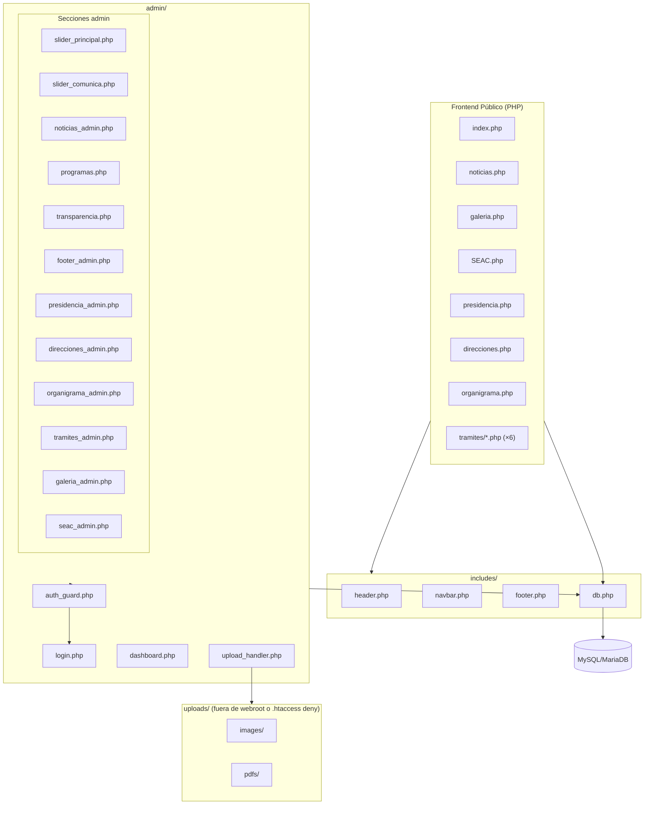
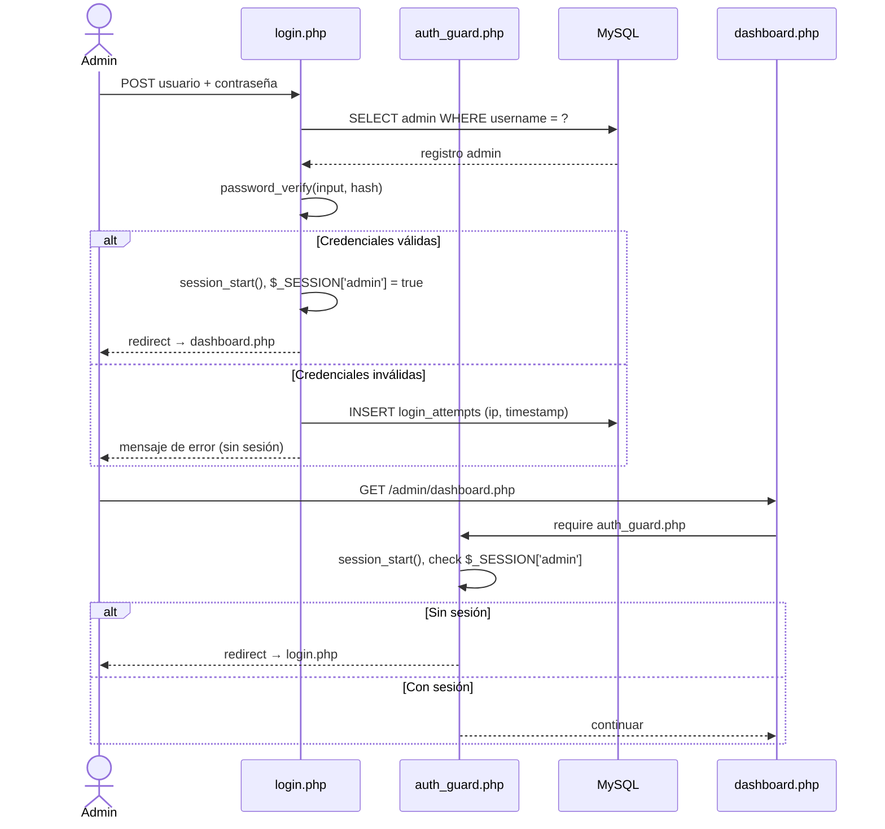

# Documento de Diseño Técnico — DIF CMS PHP Migration

## Visión General

Migración del sitio web estático HTML/CSS/JS del DIF San Mateo Atenco a PHP con un CMS integrado. El sistema conserva íntegramente el diseño visual original (Bootstrap 5, Owl Carousel, Swiper, Lightbox, WOW.js, AOS, fuentes Montserrat, paleta de colores) y añade un panel de administración protegido por autenticación que permite gestionar todo el contenido dinámico sin tocar código fuente.

**Stack tecnológico:**
- PHP 7.4+ con PDO
- MySQL 5.7+ / MariaDB 10.3+
- Bootstrap 5, Owl Carousel 2, Swiper 8, Lightbox2, WOW.js, AOS
- TinyMCE 6 (editor de texto enriquecido en el panel admin)
- Sesiones PHP nativas para autenticación

---

## Arquitectura

### Diagrama de componentes



### Flujo de autenticación



---

## Componentes e Interfaces

### Estructura de directorios del proyecto PHP

```
/                               ← raíz web (document root)
├── index.php
├── noticias.php
├── galeria.php
├── SEAC.php
├── 404.php
├── acerca-del-dif/
│   ├── presidencia.php
│   ├── direcciones.php
│   └── organigrama.php
├── comunicacion-social/
│   ├── noticias.php
│   └── galeria.php
├── tramites/
│   ├── PMPNNA.php
│   ├── DAAM.php
│   ├── DANF.php
│   ├── DAD.php
│   ├── DPAF.php
│   └── DSJAIG.php
├── transparencia/
│   └── SEAC.php
├── includes/
│   ├── db.php              ← conexión PDO singleton
│   ├── header.php          ← <head> + logos + buscador
│   ├── navbar.php          ← navegación principal
│   └── footer.php          ← footer dinámico desde DB
├── admin/
│   ├── login.php
│   ├── logout.php
│   ├── dashboard.php
│   ├── auth_guard.php
│   ├── upload_handler.php
│   ├── csrf.php            ← generación y validación de tokens CSRF
│   ├── slider_principal.php
│   ├── slider_comunica.php
│   ├── noticias.php
│   ├── programas.php
│   ├── transparencia.php
│   ├── footer.php
│   ├── presidencia.php
│   ├── direcciones.php
│   ├── organigrama.php
│   ├── tramites.php
│   ├── galeria.php
│   └── seac.php
├── css/                    ← sin cambios (archivos originales)
├── js/                     ← sin cambios
├── lib/                    ← sin cambios
├── img/                    ← imágenes estáticas originales
├── uploads/                ← archivos subidos por el admin
│   ├── images/             ← imágenes (slider, noticias, galería, etc.)
│   └── pdfs/               ← PDFs (organigrama, SEAC)
│   └── .htaccess           ← deny PHP execution
└── logs/
    └── login_attempts.log
```

### Componentes PHP principales

**`includes/db.php`** — Singleton PDO
```php
// Retorna una instancia PDO configurada con:
// - charset utf8mb4
// - PDO::ATTR_ERRMODE => PDO::ERRMODE_EXCEPTION
// - PDO::ATTR_DEFAULT_FETCH_MODE => PDO::FETCH_ASSOC
function get_db(): PDO
```

**`admin/auth_guard.php`** — Protección de rutas admin
```php
// Incluir al inicio de cada página admin (excepto login.php)
// Verifica $_SESSION['admin_logged'] === true
// Si no: destruye sesión y redirige a login.php
```

**`admin/upload_handler.php`** — Procesamiento de archivos
```php
// Valida: tipo MIME real (finfo), extensión permitida, tamaño máximo
// Renombra: bin2hex(random_bytes(16)) + extensión original
// Almacena en uploads/images/ o uploads/pdfs/
// Retorna: ['success' => bool, 'path' => string, 'error' => string]
function handle_upload(array $file, string $type = 'image'): array
```

**`admin/csrf.php`** — Tokens CSRF
```php
function csrf_token(): string      // genera y almacena token en sesión
function csrf_validate(string $token): bool  // valida token y lo invalida
```

---

## Modelos de Datos

### Esquema de base de datos

```sql
-- Administrador (único registro)
CREATE TABLE admin (
    id          INT PRIMARY KEY AUTO_INCREMENT,
    username    VARCHAR(50) NOT NULL UNIQUE,
    password    VARCHAR(255) NOT NULL  -- bcrypt hash
);

-- Intentos de login fallidos (rate limiting)
CREATE TABLE login_attempts (
    id          INT PRIMARY KEY AUTO_INCREMENT,
    ip          VARCHAR(45) NOT NULL,
    attempted_at DATETIME NOT NULL DEFAULT CURRENT_TIMESTAMP,
    INDEX idx_ip_time (ip, attempted_at)
);

-- Slider Principal
CREATE TABLE slider_principal (
    id          INT PRIMARY KEY AUTO_INCREMENT,
    imagen_path VARCHAR(500) NOT NULL,
    orden       INT NOT NULL DEFAULT 0,
    activo      TINYINT(1) NOT NULL DEFAULT 1,
    created_at  DATETIME DEFAULT CURRENT_TIMESTAMP
);

-- Slider DIF Comunica (Swiper)
CREATE TABLE slider_comunica (
    id          INT PRIMARY KEY AUTO_INCREMENT,
    imagen_path VARCHAR(500) NOT NULL,
    orden       INT NOT NULL DEFAULT 0,
    activo      TINYINT(1) NOT NULL DEFAULT 1,
    created_at  DATETIME DEFAULT CURRENT_TIMESTAMP
);

-- Noticias por día (compartido entre index y noticias.php)
CREATE TABLE noticias_imagenes (
    id          INT PRIMARY KEY AUTO_INCREMENT,
    imagen_path VARCHAR(500) NOT NULL,
    fecha_noticia DATE NOT NULL,
    activo      TINYINT(1) NOT NULL DEFAULT 1,
    created_at  DATETIME DEFAULT CURRENT_TIMESTAMP,
    INDEX idx_fecha (fecha_noticia)
);

-- Presidencia
CREATE TABLE presidencia (
    id          INT PRIMARY KEY AUTO_INCREMENT,
    imagen_path VARCHAR(500),
    nombre      VARCHAR(200) NOT NULL,
    cargo       VARCHAR(200) NOT NULL,
    updated_at  DATETIME DEFAULT CURRENT_TIMESTAMP ON UPDATE CURRENT_TIMESTAMP
);

-- Direcciones por departamento
CREATE TABLE direcciones (
    id              INT PRIMARY KEY AUTO_INCREMENT,
    departamento    VARCHAR(200) NOT NULL,
    nombre          VARCHAR(200) NOT NULL,
    cargo           VARCHAR(300) NOT NULL,
    imagen_path     VARCHAR(500),
    orden           INT NOT NULL DEFAULT 0
);

-- Organigrama
CREATE TABLE organigrama (
    id          INT PRIMARY KEY AUTO_INCREMENT,
    pdf_path    VARCHAR(500),
    titulo      VARCHAR(200) NOT NULL DEFAULT 'Organigrama 2025-2027',
    updated_at  DATETIME DEFAULT CURRENT_TIMESTAMP ON UPDATE CURRENT_TIMESTAMP
);

-- Trámites y Servicios (6 páginas)
CREATE TABLE tramites (
    id          INT PRIMARY KEY AUTO_INCREMENT,
    slug        VARCHAR(50) NOT NULL UNIQUE,  -- 'PMPNNA', 'DAAM', etc.
    titulo      VARCHAR(200) NOT NULL,
    imagen_path VARCHAR(500),
    contenido   LONGTEXT,                     -- HTML enriquecido (TinyMCE)
    updated_at  DATETIME DEFAULT CURRENT_TIMESTAMP ON UPDATE CURRENT_TIMESTAMP
);

-- Galería — Álbumes
CREATE TABLE galeria_albumes (
    id              INT PRIMARY KEY AUTO_INCREMENT,
    nombre          VARCHAR(200) NOT NULL,
    fecha_album     DATE NOT NULL,
    portada_path    VARCHAR(500),
    activo          TINYINT(1) NOT NULL DEFAULT 1,
    created_at      DATETIME DEFAULT CURRENT_TIMESTAMP
);

-- Galería — Imágenes por álbum
CREATE TABLE galeria_imagenes (
    id          INT PRIMARY KEY AUTO_INCREMENT,
    album_id    INT NOT NULL,
    imagen_path VARCHAR(500) NOT NULL,
    orden       INT NOT NULL DEFAULT 0,
    FOREIGN KEY (album_id) REFERENCES galeria_albumes(id) ON DELETE CASCADE
);

-- SEAC — Bloques por año
CREATE TABLE seac_bloques (
    id      INT PRIMARY KEY AUTO_INCREMENT,
    anio    YEAR NOT NULL UNIQUE,
    orden   INT NOT NULL DEFAULT 0
);

-- SEAC — Conceptos (filas de la tabla)
CREATE TABLE seac_conceptos (
    id          INT PRIMARY KEY AUTO_INCREMENT,
    numero      INT NOT NULL,
    nombre      VARCHAR(500) NOT NULL,
    orden       INT NOT NULL DEFAULT 0
);

-- SEAC — PDFs por bloque/trimestre/concepto
CREATE TABLE seac_pdfs (
    id          INT PRIMARY KEY AUTO_INCREMENT,
    bloque_id   INT NOT NULL,
    concepto_id INT NOT NULL,
    trimestre   TINYINT NOT NULL CHECK (trimestre BETWEEN 1 AND 4),
    pdf_path    VARCHAR(500),
    FOREIGN KEY (bloque_id) REFERENCES seac_bloques(id) ON DELETE CASCADE,
    FOREIGN KEY (concepto_id) REFERENCES seac_conceptos(id),
    UNIQUE KEY uk_bloque_concepto_trim (bloque_id, concepto_id, trimestre)
);

-- Nuestros Programas
CREATE TABLE programas (
    id          INT PRIMARY KEY AUTO_INCREMENT,
    nombre      VARCHAR(200) NOT NULL,
    imagen_path VARCHAR(500),
    orden       INT NOT NULL DEFAULT 0,
    activo      TINYINT(1) NOT NULL DEFAULT 1
);

-- Secciones de acordeón por programa
CREATE TABLE programas_secciones (
    id          INT PRIMARY KEY AUTO_INCREMENT,
    programa_id INT NOT NULL,
    titulo      VARCHAR(300) NOT NULL,
    contenido   TEXT NOT NULL,
    orden       INT NOT NULL DEFAULT 0,
    FOREIGN KEY (programa_id) REFERENCES programas(id) ON DELETE CASCADE
);

-- Transparencia del index
CREATE TABLE transparencia_items (
    id          INT PRIMARY KEY AUTO_INCREMENT,
    titulo      VARCHAR(300) NOT NULL,
    url         VARCHAR(1000) NOT NULL,
    imagen_path VARCHAR(500),
    orden       INT NOT NULL DEFAULT 0,
    activo      TINYINT(1) NOT NULL DEFAULT 1
);

-- Footer (registro único, id=1)
CREATE TABLE footer_config (
    id              INT PRIMARY KEY AUTO_INCREMENT,
    texto_inst      TEXT,
    horario         VARCHAR(200),
    direccion       TEXT,
    telefono        VARCHAR(50),
    email           VARCHAR(200),
    url_facebook    VARCHAR(500),
    url_twitter     VARCHAR(500),
    url_instagram   VARCHAR(500),
    updated_at      DATETIME DEFAULT CURRENT_TIMESTAMP ON UPDATE CURRENT_TIMESTAMP
);
```

---

## Diseño del Panel de Administración

### Dashboard

El dashboard (`admin/dashboard.php`) muestra un menú de tarjetas con acceso directo a cada sección gestionable. Usa el mismo Bootstrap 5 del sitio con una barra lateral colapsable.

### Patrón común de cada sección admin

Cada sección admin sigue el mismo patrón CRUD:

1. **Listado** — tabla con registros actuales, botones Editar/Eliminar
2. **Formulario de alta/edición** — campos del modelo + campo de archivo si aplica + token CSRF oculto
3. **Procesamiento POST** — validar CSRF → validar datos → llamar `handle_upload()` si hay archivo → PDO prepare/execute → redirect con mensaje flash

### Gestión de archivos subidos

- Directorio `uploads/` con `.htaccess` que deniega ejecución de PHP
- Nombres de archivo: `bin2hex(random_bytes(16)) . '.' . $ext`
- Al eliminar un registro: `unlink()` del archivo antes de DELETE en DB
- Al reemplazar: eliminar archivo anterior → subir nuevo → actualizar DB

---

## Propiedades de Corrección

*Una propiedad es una característica o comportamiento que debe mantenerse verdadero en todas las ejecuciones válidas del sistema — esencialmente, un enunciado formal sobre lo que el sistema debe hacer. Las propiedades sirven como puente entre las especificaciones legibles por humanos y las garantías de corrección verificables por máquina.*

### Propiedad 1: Autenticación — credenciales válidas siempre inician sesión

*Para cualquier* par de credenciales (usuario, contraseña) que coincidan con el registro de administrador en la DB, el sistema SHALL iniciar una sesión autenticada y redirigir al dashboard.

**Valida: Requisitos 1.2**

---

### Propiedad 2: Autenticación — credenciales inválidas nunca inician sesión

*Para cualquier* par de credenciales que NO coincidan con el registro de administrador (usuario incorrecto, contraseña incorrecta, o ambos), el sistema SHALL rechazar el acceso y no crear sesión autenticada.

**Valida: Requisitos 1.3**

---

### Propiedad 3: Protección de rutas admin sin sesión

*Para cualquier* ruta dentro de `/admin/` (excepto `login.php`), si no existe una sesión autenticada activa, el sistema SHALL redirigir a `login.php` sin mostrar contenido protegido.

**Valida: Requisitos 1.4**

---

### Propiedad 4: Cierre de sesión destruye la sesión (round-trip)

*Para cualquier* sesión autenticada activa, después de ejecutar el logout, la sesión SHALL estar destruida y cualquier intento de acceder a rutas admin SHALL redirigir a login.

**Valida: Requisitos 1.5**

---

### Propiedad 5: Rate limiting de intentos de login

*Para cualquier* IP que realice 5 o más intentos de login fallidos consecutivos en un período de 15 minutos, el sistema SHALL bloquear el intento número 6 en adelante sin procesarlo.

**Valida: Requisitos 1.7**

---

### Propiedad 6: Validación de archivos subidos — tipo y tamaño

*Para cualquier* archivo enviado al Upload_Handler, si el tipo MIME real (verificado con `finfo`) no está en la lista de permitidos (image/jpeg, image/png, image/webp para imágenes; application/pdf para PDFs) o si el tamaño supera el límite configurado, el sistema SHALL rechazar el archivo y no almacenarlo.

**Valida: Requisitos 2.2, 3.2, 4.2, 5.2, 6.2, 7.2, 8.2, 9.3, 11.3, 12.3, 15.2**

---

### Propiedad 7: Renombrado aleatorio de archivos subidos

*Para cualquier* archivo subido exitosamente, el nombre del archivo almacenado en el servidor SHALL ser diferente al nombre original del archivo enviado por el cliente.

**Valida: Requisitos 15.3**

---

### Propiedad 8: Round-trip de contenido de sliders

*Para cualquier* imagen subida a un slider (Principal o DIF Comunica), después de la operación de alta, la consulta a la DB SHALL retornar un registro que incluya la ruta del archivo almacenado, y el HTML renderizado de la página correspondiente SHALL contener un elemento `` con esa ruta.

**Valida: Requisitos 2.2, 2.5, 3.2, 3.5**

---

### Propiedad 9: Eliminación completa de recursos (archivos + DB)

*Para cualquier* recurso (imagen o PDF) registrado en la DB, después de ejecutar la operación de eliminación, el registro SHALL no existir en la DB Y el archivo SHALL no existir en el sistema de archivos del servidor.

**Valida: Requisitos 2.4, 3.4, 4.4, 5.2 (reemplazo), 9.4, 9.5, 11.5, 11.6, 12.5**

---

### Propiedad 10: Filtrado de noticias por fecha actual

*Para cualquier* conjunto de imágenes de noticias con fechas variadas almacenadas en la DB, el HTML renderizado de `index.php` y `noticias.php` SHALL contener únicamente las imágenes cuya `fecha_noticia` sea igual a la fecha actual del servidor (`date('Y-m-d')`).

**Valida: Requisitos 4.5, 10.2**

---

### Propiedad 11: Round-trip de texto enriquecido en trámites

*Para cualquier* contenido HTML guardado en la tabla `tramites` para un slug dado, al recuperar ese registro de la DB y renderizar la página correspondiente, el contenido HTML SHALL ser idéntico al guardado originalmente.

**Valida: Requisitos 8.3, 8.4**

---

### Propiedad 12: Integridad referencial de álbumes de galería

*Para cualquier* álbum eliminado de `galeria_albumes`, todas las filas de `galeria_imagenes` con ese `album_id` SHALL ser eliminadas en cascada (ON DELETE CASCADE), y los archivos de imagen correspondientes SHALL ser eliminados del servidor.

**Valida: Requisitos 9.5**

---

### Propiedad 13: Renderizado correcto de bloques SEAC por año

*Para cualquier* conjunto de bloques SEAC almacenados en la DB, el HTML renderizado de `SEAC.php` SHALL contener un elemento `<article class="question">` por cada bloque, con la tabla de trimestres correcta y los enlaces a PDFs correspondientes a cada celda (bloque_id, concepto_id, trimestre).

**Valida: Requisitos 11.7**

---

### Propiedad 14: Protección CSRF — rechazo de POST sin token válido

*Para cualquier* formulario POST del panel admin enviado sin un token CSRF válido (ausente, expirado o incorrecto), el sistema SHALL rechazar la solicitud y no ejecutar ninguna operación de escritura en la DB ni en el sistema de archivos.

**Valida: Requisitos 15.5**

---

### Propiedad 15: Inyección SQL — sentencias preparadas

*Para cualquier* valor de entrada del usuario que contenga caracteres especiales SQL (comillas, punto y coma, comentarios `--`, etc.), al procesarlo mediante PDO `prepare`/`execute`, la consulta SHALL ejecutarse correctamente sin alterar su estructura lógica ni retornar datos no autorizados.

**Valida: Requisitos 15.1**

---

### Propiedad 16: Round-trip del footer en todas las páginas

*Para cualquier* configuración de footer guardada en `footer_config`, todas las páginas PHP del sitio (index, noticias, galería, SEAC, presidencia, direcciones, organigrama, trámites) SHALL renderizar el footer con los valores actualizados de la DB.

**Valida: Requisitos 14.3**

---

## Manejo de Errores

### Errores de autenticación
- Credenciales inválidas: mensaje genérico "Usuario o contraseña incorrectos" (sin distinguir cuál falló)
- IP bloqueada: mensaje "Demasiados intentos. Intente en 15 minutos"
- Sesión expirada: redirect silencioso a login con parámetro `?expired=1`

### Errores de subida de archivos
- Tipo MIME inválido: "Tipo de archivo no permitido. Use JPG, PNG o WEBP"
- Tamaño excedido: "El archivo supera el tamaño máximo de X MB"
- Error de escritura en disco: log en `logs/upload_errors.log` + mensaje genérico al usuario

### Errores de base de datos
- Todas las consultas PDO en bloques `try/catch(PDOException $e)`
- En producción: log del error + mensaje genérico al usuario (sin exponer detalles)
- En desarrollo: mostrar mensaje completo (controlado por constante `APP_DEBUG`)

### Fallbacks de contenido
- Slider sin imágenes: imagen placeholder `img/placeholder.jpg`
- Presidencia sin imagen: `img/Presidente.png`
- Organigrama sin PDF: imagen `img/organigrama_dif_sma.jpg`
- Trámite sin imagen: imagen original del diseño estático
- Noticias sin imágenes del día: mensaje "No hay noticias disponibles para hoy"
- Programas vacíos: mensaje "No hay programas disponibles"
- Transparencia vacía: mensaje "No hay contenido de transparencia disponible"

---

## Estrategia de Pruebas

### Pruebas unitarias (PHPUnit)

Cubren ejemplos concretos, casos borde y condiciones de error:

- `AuthTest`: login con credenciales correctas, login con credenciales incorrectas, logout destruye sesión, bloqueo tras 5 intentos
- `UploadHandlerTest`: archivo válido aceptado, MIME inválido rechazado, tamaño excedido rechazado, nombre renombrado aleatoriamente
- `CsrfTest`: token válido aceptado, token inválido rechazado, token ausente rechazado
- `FooterTest`: footer con DB vacía muestra valores predeterminados
- `NoticiasTest`: sin noticias del día muestra mensaje correcto

### Pruebas basadas en propiedades (property-based testing)

Se usa **[QuickCheck para PHP](https://github.com/steos/php-quickcheck)** o alternativamente **[Eris](https://github.com/giorgiosironi/eris)** como librería PBT.

Cada prueba de propiedad se configura con **mínimo 100 iteraciones**.

Formato de etiqueta para cada test:
`Feature: dif-cms-php-migration, Property {N}: {texto de la propiedad}`

**Tests de propiedades a implementar:**

```
// Feature: dif-cms-php-migration, Property 2: credenciales inválidas nunca inician sesión
// Para cualquier string de usuario/contraseña que no coincida con el admin registrado,
// auth() debe retornar false
test_property_invalid_credentials_never_authenticate()  → 100 iteraciones

// Feature: dif-cms-php-migration, Property 3: rutas admin sin sesión redirigen a login
// Para cualquier ruta /admin/*.php (excepto login), sin sesión → Location: login.php
test_property_admin_routes_redirect_without_session()  → 100 iteraciones

// Feature: dif-cms-php-migration, Property 5: rate limiting tras 5 intentos
// Para cualquier IP, tras 5 intentos fallidos, el 6to debe ser bloqueado
test_property_rate_limit_blocks_after_five_attempts()  → 100 iteraciones

// Feature: dif-cms-php-migration, Property 6: validación de archivos
// Para cualquier archivo con MIME inválido o tamaño > límite, handle_upload() retorna success=false
test_property_upload_rejects_invalid_files()  → 100 iteraciones

// Feature: dif-cms-php-migration, Property 7: renombrado aleatorio
// Para cualquier nombre de archivo original, el nombre almacenado es diferente
test_property_uploaded_files_are_renamed()  → 100 iteraciones

// Feature: dif-cms-php-migration, Property 8: round-trip de sliders
// Para cualquier N imágenes insertadas en slider_principal, el HTML contiene N 
test_property_slider_renders_all_db_images()  → 100 iteraciones

// Feature: dif-cms-php-migration, Property 10: filtrado de noticias por fecha
// Para cualquier conjunto de noticias con fechas variadas, solo aparecen las del día actual
test_property_noticias_filtered_by_current_date()  → 100 iteraciones

// Feature: dif-cms-php-migration, Property 11: round-trip texto enriquecido
// Para cualquier string HTML, guardar y recuperar de tramites produce el mismo contenido
test_property_tramite_content_roundtrip()  → 100 iteraciones

// Feature: dif-cms-php-migration, Property 14: CSRF rechaza POST sin token
// Para cualquier POST sin token CSRF válido, el handler retorna 403 sin escribir en DB
test_property_csrf_rejects_invalid_tokens()  → 100 iteraciones

// Feature: dif-cms-php-migration, Property 15: SQL injection via PDO
// Para cualquier string con caracteres SQL especiales como input, la consulta no falla
// ni retorna datos de otros registros
test_property_pdo_prepared_statements_prevent_injection()  → 100 iteraciones
```

### Pruebas de integración

- Flujo completo: login → subir imagen → verificar en frontend → eliminar → verificar ausencia
- Flujo SEAC: crear bloque → subir PDF a celda → verificar renderizado → eliminar bloque → verificar cascada
- Flujo galería: crear álbum → agregar imágenes → verificar Lightbox en frontend → eliminar álbum → verificar cascada

### Consideraciones de seguridad en pruebas

- Verificar que `uploads/.htaccess` deniega ejecución de PHP subiendo un archivo `.php` disfrazado
- Verificar que el log de intentos fallidos se escribe correctamente con IP y timestamp
- Verificar que los hashes de contraseña usan `PASSWORD_BCRYPT` mediante `password_get_info()`
