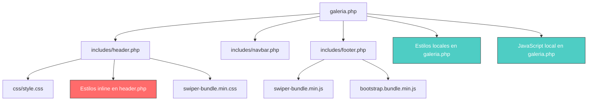
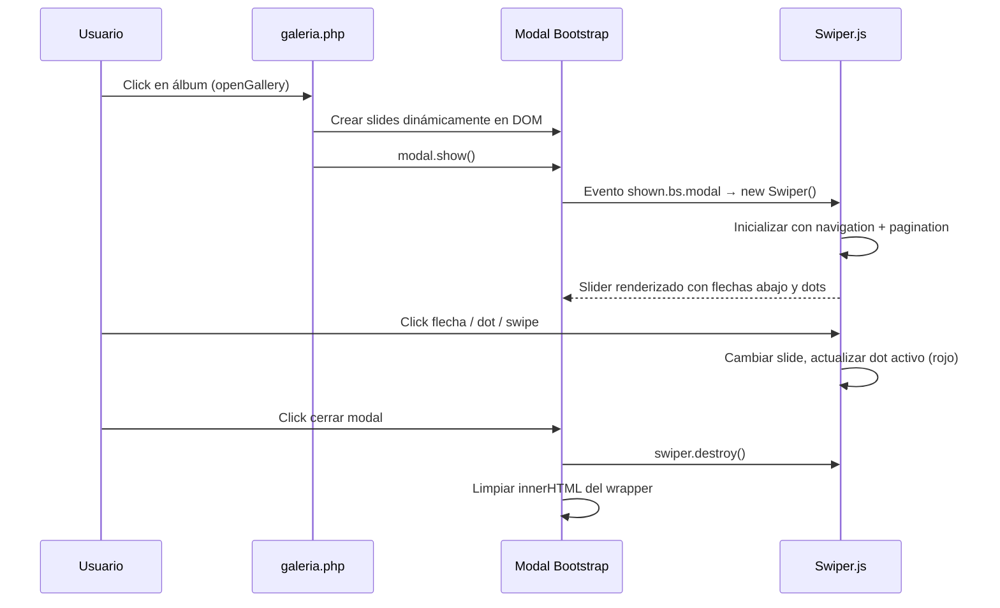

# Documento de Diseño: Gallery Slider Fix

## Resumen

La galería fotográfica del DIF San Mateo Atenco (`comunicacion-social/galeria.php`) presenta un bug donde las imágenes del slider dentro del modal se ven en blanco en la versión de escritorio, mientras que en móvil funcionan correctamente. Esto se debe a que los estilos globales de Swiper definidos en `includes/header.php` aplican `opacity: 0.3` y `transform: scale(0.82)` a todos los `.swiper-slide`, pero solo en móvil (≤480px) se sobreescriben a `opacity: 1`. Además, se requiere rediseñar la navegación del slider: mover las flechas a la parte inferior, agregar indicadores de puntos (círculos) con color negro cuando están inactivos y rojo cuando están activos, y dar un aspecto profesional al conjunto.

## Arquitectura



El nodo rojo (`Estilos inline en header.php`) es la fuente del bug. Los nodos verdes (`Estilos/JS locales en galeria.php`) son los archivos a modificar.

## Diagrama de Secuencia — Flujo del Slider de Galería



## Componentes e Interfaces

### Componente 1: Estilos CSS de la Galería (galeria.php `<style>`)

**Propósito**: Definir estilos específicos del slider de galería que sobreescriban los estilos globales de Swiper del header y configuren la nueva disposición de navegación.

**Interfaz CSS**:
```css
/* Corregir el bug de opacidad en desktop */
.gallery-swiper .swiper-slide {
    opacity: 1 !important;
    transform: scale(1) !important;
}

/* Contenedor de controles de navegación (flechas + dots) */
.gallery-controls {
    display: flex;
    align-items: center;
    justify-content: center;
    gap: 16px;
    padding: 12px 0;
}

/* Flechas de navegación reposicionadas */
.gallery-nav-btn { /* botón prev/next personalizado */ }

/* Indicadores de puntos */
.gallery-swiper .swiper-pagination-bullet { /* negro inactivo */ }
.gallery-swiper .swiper-pagination-bullet-active { /* rojo activo */ }
```

**Responsabilidades**:
- Sobreescribir `opacity` y `transform` globales de Swiper para que las imágenes sean visibles en desktop
- Posicionar flechas de navegación debajo del slider
- Estilizar dots: negro (#000) inactivo, rojo (rgb(200,16,44)) activo
- Mantener responsividad en móvil y tablet

### Componente 2: Estructura HTML del Modal (galeria.php)

**Propósito**: Reestructurar el modal para que los controles de navegación (flechas y dots) estén fuera del contenedor Swiper, posicionados debajo.

**Interfaz HTML**:
```html
<div class="modal-body p-3">
    <!-- Slider sin flechas internas -->
    <div class="swiper gallery-swiper">
        <div class="swiper-wrapper" id="gallerySwiperWrapper"></div>
    </div>
    <!-- Controles debajo del slider -->
    <div class="gallery-controls">
        <button class="gallery-nav-btn gallery-prev" aria-label="Anterior">
            <i class="fas fa-chevron-left"></i>
        </button>
        <div class="swiper-pagination gallery-pagination"></div>
        <button class="gallery-nav-btn gallery-next" aria-label="Siguiente">
            <i class="fas fa-chevron-right"></i>
        </button>
    </div>
</div>
```

### Componente 3: Inicialización JavaScript de Swiper (galeria.php `<script>`)

**Propósito**: Configurar Swiper con navegación externa (flechas fuera del contenedor) y paginación con dots.

**Interfaz JS**:
```javascript
gallerySwiper = new Swiper('.gallery-swiper', {
    slidesPerView: 1,
    spaceBetween: 20,
    centeredSlides: true,
    loop: true,
    grabCursor: true,
    navigation: {
        nextEl: '.gallery-next',
        prevEl: '.gallery-prev'
    },
    pagination: {
        el: '.gallery-pagination',
        clickable: true
    }
});
```

## Modelos de Datos

No se requieren cambios en la base de datos ni en los modelos de datos PHP. Los datos de álbumes e imágenes se mantienen igual.

### Estructura de datos existente (sin cambios):
```javascript
// albumesData — array generado por PHP
[
    {
        nombre: "Nombre del álbum",
        imagenes: ["../uploads/galeria/img1.jpg", "../uploads/galeria/img2.jpg"]
    }
]
```

## Pseudocódigo Algorítmico

### Algoritmo: Corrección de Estilos CSS

```pascal
ALGORITMO corregirEstilosGaleria
ENTRADA: Estilos CSS actuales de galeria.php
SALIDA: Estilos CSS corregidos

INICIO
  // Paso 1: Sobreescribir estilos globales de Swiper del header
  PARA CADA .gallery-swiper .swiper-slide HACER
    ESTABLECER opacity = 1 !important
    ESTABLECER transform = scale(1) !important
    // Esto anula los estilos globales:
    //   .swiper .swiper-slide { opacity: 0.3 !important }
    //   .swiper-slide { opacity: 0.45; transform: scale(0.82) }
  FIN PARA

  // Paso 2: Remover flechas internas de Swiper
  ELIMINAR .swiper-button-next del HTML del modal
  ELIMINAR .swiper-button-prev del HTML del modal

  // Paso 3: Crear contenedor de controles externo
  CREAR .gallery-controls debajo de .gallery-swiper
  INSERTAR botón .gallery-prev EN .gallery-controls
  INSERTAR .gallery-pagination EN .gallery-controls
  INSERTAR botón .gallery-next EN .gallery-controls

  // Paso 4: Estilizar dots
  PARA CADA .swiper-pagination-bullet HACER
    ESTABLECER background = #000 (negro)
    ESTABLECER width = 10px, height = 10px
    ESTABLECER border-radius = 50%
  FIN PARA

  PARA CADA .swiper-pagination-bullet-active HACER
    ESTABLECER background = rgb(200,16,44) (rojo DIF)
    ESTABLECER width = 28px
    ESTABLECER border-radius = 5px
  FIN PARA
FIN
```

**Precondiciones:**
- El archivo `galeria.php` existe y contiene el modal con Swiper
- La librería Swiper.js está cargada desde `footer.php`
- Los estilos globales de Swiper están en `header.php` (inline `<style>`)

**Postcondiciones:**
- Las imágenes del slider son visibles en desktop (opacity: 1)
- Las flechas de navegación están posicionadas debajo del slider
- Los dots indicadores aparecen entre las flechas
- Los dots inactivos son negros, el activo es rojo
- El comportamiento en móvil se mantiene funcional

### Algoritmo: Inicialización de Swiper con Controles Externos

```pascal
ALGORITMO inicializarGallerySwiper
ENTRADA: índice del álbum seleccionado
SALIDA: Swiper inicializado con navegación y paginación

INICIO
  album ← albumesData[idx]
  SI album ES NULO O album.imagenes ESTÁ VACÍO ENTONCES
    RETORNAR
  FIN SI

  // Paso 1: Poblar slides
  wrapper ← getElementById('gallerySwiperWrapper')
  wrapper.innerHTML ← ''
  PARA CADA src EN album.imagenes HACER
    slide ← crearElemento('div', clase='swiper-slide')
    slide.innerHTML ← ''
    wrapper.appendChild(slide)
  FIN PARA

  // Paso 2: Mostrar modal
  modal ← new bootstrap.Modal(getElementById('galleryModal'))
  modal.show()

  // Paso 3: Inicializar Swiper cuando modal esté visible
  AL EVENTO 'shown.bs.modal' HACER
    SI gallerySwiper EXISTE ENTONCES
      gallerySwiper.destroy(true, true)
    FIN SI

    gallerySwiper ← new Swiper('.gallery-swiper', {
      slidesPerView: 1,
      spaceBetween: 20,
      centeredSlides: true,
      loop: true,
      grabCursor: true,
      navigation: {
        nextEl: '.gallery-next',
        prevEl: '.gallery-prev'
      },
      pagination: {
        el: '.gallery-pagination',
        clickable: true
      }
    })
  FIN EVENTO
FIN
```

**Precondiciones:**
- `albumesData` está definido y contiene datos válidos
- El modal `#galleryModal` existe en el DOM
- Swiper.js y Bootstrap están cargados

**Postcondiciones:**
- El slider muestra la primera imagen del álbum
- Las flechas prev/next funcionan correctamente
- Los dots reflejan el número de imágenes y el slide activo
- Al cerrar el modal, Swiper se destruye y el DOM se limpia

## Ejemplo de Uso

### HTML del modal corregido:
```html
<div class="modal-body p-3">
    <div class="swiper gallery-swiper">
        <div class="swiper-wrapper" id="gallerySwiperWrapper"></div>
    </div>
    <div class="gallery-controls">
        <button class="gallery-nav-btn gallery-prev" aria-label="Anterior">
            <i class="fas fa-chevron-left"></i>
        </button>
        <div class="swiper-pagination gallery-pagination"></div>
        <button class="gallery-nav-btn gallery-next" aria-label="Siguiente">
            <i class="fas fa-chevron-right"></i>
        </button>
    </div>
</div>
```

### CSS corregido:
```css
/* Fix: sobreescribir estilos globales de Swiper */
.gallery-swiper .swiper-slide {
    opacity: 1 !important;
    transform: scale(1) !important;
}

/* Controles de navegación debajo del slider */
.gallery-controls {
    display: flex;
    align-items: center;
    justify-content: center;
    gap: 16px;
    padding: 12px 0 4px;
}

.gallery-nav-btn {
    width: 40px;
    height: 40px;
    border-radius: 50%;
    border: 2px solid rgb(200,16,44);
    background: #fff;
    color: rgb(200,16,44);
    font-size: 16px;
    cursor: pointer;
    display: flex;
    align-items: center;
    justify-content: center;
    transition: background 0.2s, color 0.2s;
}
.gallery-nav-btn:hover {
    background: rgb(200,16,44);
    color: #fff;
}

/* Dots: negro inactivo, rojo activo */
.gallery-pagination .swiper-pagination-bullet {
    width: 10px;
    height: 10px;
    background: #000;
    opacity: 1;
    border-radius: 50%;
    transition: background 0.25s, width 0.25s;
}
.gallery-pagination .swiper-pagination-bullet-active {
    background: rgb(200,16,44);
    width: 28px;
    border-radius: 5px;
}
```

## Propiedades de Correctitud

1. **∀ slide ∈ .gallery-swiper**: `opacity === 1` en todas las resoluciones de pantalla (desktop, tablet, móvil)
2. **∀ dot ∈ .gallery-pagination**: dot inactivo tiene `background: #000`, dot activo tiene `background: rgb(200,16,44)`
3. **∀ álbum con N imágenes**: el número de dots renderizados === N
4. **∀ cambio de slide**: exactamente 1 dot tiene la clase `swiper-pagination-bullet-active`
5. **∀ apertura de modal**: Swiper se inicializa después del evento `shown.bs.modal` (no antes)
6. **∀ cierre de modal**: Swiper se destruye y el wrapper se limpia

## Manejo de Errores

### Escenario 1: Álbum sin imágenes
**Condición**: `album.imagenes` es un array vacío
**Respuesta**: La función `openGallery` retorna sin abrir el modal
**Recuperación**: No se requiere acción adicional

### Escenario 2: Swiper no cargado
**Condición**: La librería Swiper.js no se cargó correctamente
**Respuesta**: El bloque try/catch previene errores fatales; el modal se abre pero sin funcionalidad de slider
**Recuperación**: Las imágenes siguen siendo visibles como elementos estáticos

### Escenario 3: Estilos globales cambian en el futuro
**Condición**: Se modifican los estilos de Swiper en `header.php`
**Respuesta**: Los `!important` en `.gallery-swiper .swiper-slide` garantizan que la galería mantiene `opacity: 1`
**Recuperación**: La especificidad del selector `.gallery-swiper .swiper-slide` es mayor que `.swiper .swiper-slide`

## Estrategia de Testing

### Testing Manual
1. Abrir `galeria.php` en navegador desktop (Chrome, Firefox, Safari) → verificar que las imágenes son visibles
2. Abrir en modo responsive (tablet 768px, móvil 480px) → verificar que sigue funcionando
3. Navegar con flechas → verificar que cambian de slide
4. Verificar que los dots se actualizan al cambiar de slide
5. Verificar colores: dot inactivo = negro, dot activo = rojo
6. Abrir y cerrar el modal varias veces → verificar que no hay memory leaks de Swiper

### Testing de Regresión
- Verificar que el slider principal de la página de inicio (`index.php`) no se ve afectado por los cambios
- Verificar que el slider de comunicación social no se ve afectado
- Verificar que los estilos globales de Swiper en `header.php` no se modificaron

## Consideraciones de Rendimiento

- Los estilos CSS usan selectores específicos (`.gallery-swiper .swiper-slide`) en lugar de selectores globales para evitar repintados innecesarios
- Swiper se destruye al cerrar el modal para liberar memoria
- No se agregan nuevas dependencias; se reutiliza Swiper.js y Font Awesome ya cargados

## Consideraciones de Seguridad

- Las rutas de imágenes ya están sanitizadas con `htmlspecialchars()` en el PHP existente
- No se introducen nuevos inputs del usuario
- No se requieren cambios en la lógica del servidor

## Dependencias

- **Swiper.js** (ya incluido via CDN en `footer.php`) — para slider con navigation y pagination
- **Bootstrap 5** (ya incluido) — para el modal
- **Font Awesome 5** (ya incluido) — para iconos de flechas (`fa-chevron-left`, `fa-chevron-right`)
- No se requieren nuevas dependencias
